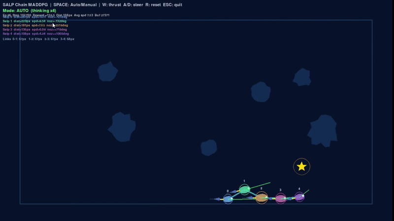

# Salp Chain Navigation via Multi-Agent Reinforcement Learning

> *Nature figured out collective intelligence millions of years ago. We taught it to play Connect Four.*

A multi-agent reinforcement learning system where a **biologically-inspired salp chain** — a rigid sequence of linked agents — learns to cooperatively navigate toward a goal while dodging obstacles. Three MARL algorithms go head-to-head. One chain to rule them all.

---

## What Is This?

Salps are barrel-shaped sea creatures that form long chains and move with eerily coordinated grace. This project borrows that architecture: a **chain of RL agents physically linked by rigid rod constraints**, forced to coordinate movement without centralized control.

The catch? Each agent in the chain has its own policy, its own observations, its own actions — but the chain lives or dies together.

**The core challenge**: maintain rigid inter-agent distances, avoid polygon-shaped obstacles, and reach the goal — all while algorithms that disagree on *how* to cooperate compete for dominance.

---

## Algorithms Implemented

| Algorithm | Type | Key Idea |
|-----------|------|----------|
| **IQL** — Independent Q-Learning | Decentralized | Each agent trains its own Q-network, ignoring teammates |
| **MADDPG** — Multi-Agent Deep Deterministic Policy Gradient | Centralized Training, Decentralized Execution | Critics see all agents' states; actors act independently |
| **MAPPO** — Multi-Agent Proximal Policy Optimization | Centralized Training, Decentralized Execution | Shared value function with clipped policy updates for stability |

---

## Key Features

**Rigid Chain Constraint**
Fixed inter-agent distances enforced at every timestep — no stretching, no breaking. The chain moves as one or not at all.

**Physics-Based Dynamics**
Velocity, drag, and thrust modelling give the chain realistic, fluid-like movement behavior.

**Polygon Obstacle Avoidance**
Convex polygon collision detection. The world isn't empty — the chain has to *think* around obstacles.

**Emergent Cooperation**
Agents share a collective reward signal. No agent wins unless the chain wins.

---

## Repository Structure

```
.
├── python_codes/        # Training scripts for IQL, MADDPG, MAPPO
├── pickled_models/      # Pretrained model weights (ready to demo)
├── csv_outputs/         # Per-episode reward logs
├── outputs/             # Training curves and evaluation plots
├── assets/              # Demo GIFs and visuals
├── demo.py              # Run a single pretrained model
├── demo_all.py          # Run and compare all three algorithms
├── train_all.py         # Train all algorithms from scratch
├── run.sh               # One-command full pipeline
└── requirements.txt     # Python dependencies
```

---

## Quickstart


```bash
bash run.sh
```

`run.sh` handles **everything**:
- Creates an isolated virtual environment
- Installs all dependencies
- Loads pretrained models from `pickled_models/`
- Launches the demo environment

---

### Manual Run

```bash
# Install dependencies
pip install -r requirements.txt

# Run demo UI
python demo.py

# Run and compare all three algorithms
python demo_all.py

# Train everything from scratch
python train_all.py
```

---

##  Demo

The demo loads pretrained weights and visualizes the salp chain in action:

- **Salp chain movement** with rigid link enforcement
- **Obstacle positions** rendered as polygons
- **Goal marker** the chain navigates toward
- **Real-time constraint visualization**

<p align="center">
  
</p>

---

## Outputs

After training or running `demo_all.py`, results are saved automatically in a folder with their respective names

| Output | Contents |
|--------|----------|
| Training logs | Episode rewards, step counts per algorithm |
| Learning curves | Reward-vs-episode plots |
| Saved models | Serialized policy weights |

---

## The Biology Behind It

Real salps (*Thaliacea*) form chains up to 15 metres long and navigate ocean currents through jet propulsion. Each individual pulses water through its body, but the chain's direction emerges from collective action — no single salp is "in charge."

This project formalizes that structure as a **constrained MARL problem**: agents with local observations, rigid physical coupling, and a shared survival objective. It's cooperative RL with a biophysical backbone.

---

## Tech Stack

- **Python** (98.8% of codebase)
- **PyTorch** — neural network policies and Q-networks
- **NumPy / Matplotlib** — environment dynamics and visualization
- **Pickle** — model serialization

---

## Authors

Built by a team of four who apparently looked at the ocean and thought *"that chain of creatures would make a great RL benchmark"*:

- **Anandita Garg**
- **Avantika Bansal**
- **Puneet Madan**
- **Trusha Maheshwari**
